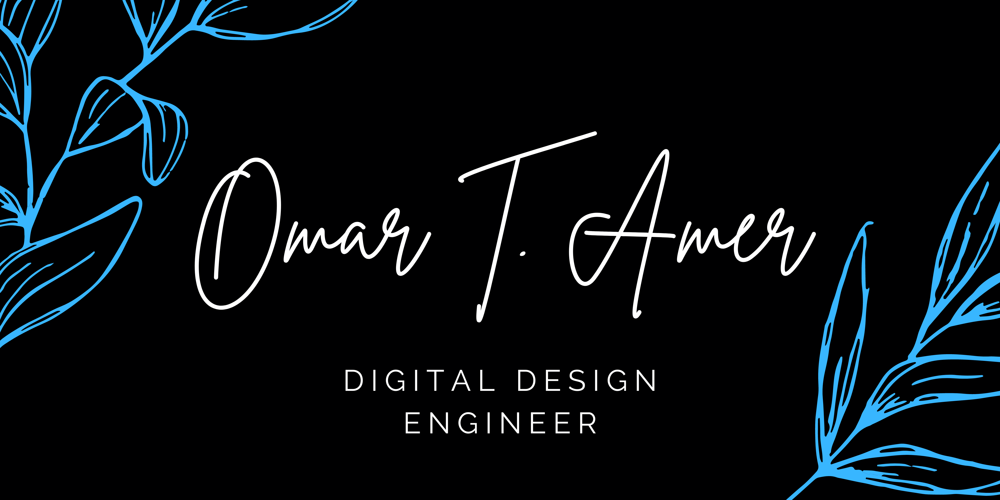

Hello 👋  
I'm Omar Amer. Software QA engineer @ Siemens by day, Digital design engineer by night. I graduated from Cairo University Faculty of Engineering where I used to be a teaching assistant for a year. I also worked as a research assistant at the AUC where I published my [first paper](https://ieeexplore.ieee.org/document/10815856).

## 📌 Pinned Repositories

## 🤹 Skills

### HDL

### Scripting

### Programming

